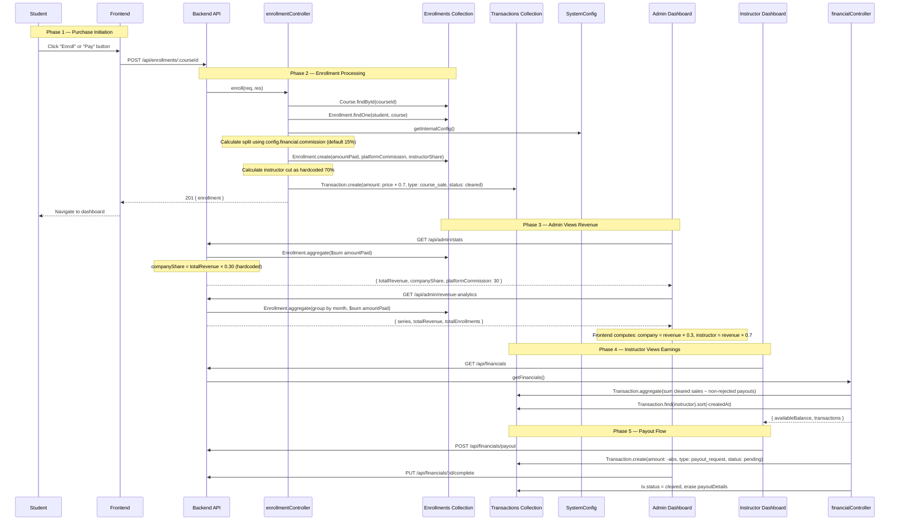

# Revenue Flow — Complete Reverse-Engineering Analysis

## Executive Summary

The platform uses a **direct enrollment model with no real payment gateway**. When a student clicks "Enroll" or completes the cart checkout, the backend immediately creates an `Enrollment` record and a `Transaction` record — **no actual money changes hands through the code**. Revenue is calculated using a **dual-system** that is internally inconsistent (detailed in [Bugs](#bugs--architectural-weaknesses)).

---

## Step-by-Step Execution Flow

### Phase 1: Student Initiates Purchase

**Two entry points exist:**

#### Entry Point A — Course Page Direct Enroll
1. Student views a course → [CoursePage.jsx](file:///C:/Users/ahmad/Desktop/program-week2/client/src/components/CoursePage.jsx#L49-L63)
2. Clicks **"Enroll Now"** button
3. Calls `api.post(`/enrollments/${id}`)` — a single POST request

#### Entry Point B — Cart Checkout
1. Student adds courses to cart, navigates to `/checkout/cart`
2. [CheckoutPage.jsx](file:///C:/Users/ahmad/Desktop/program-week2/client/src/components/CheckoutPage.jsx#L48-L104)
3. Clicks **"Pay"** button → `handleCheckout()` loops through cart items
4. For **each** course in the cart: calls `api.post(`/enrollments/${courseId}`)` sequentially
5. On success, removes items from cart and redirects to `/student/dashboard`

> [!IMPORTANT]
> **No real payment processing occurs.** The checkout page displays payment method options (Credit Card, Apple Pay, Google Pay, Fawry) purely as UI elements. No Paymob, Stripe, or any payment gateway is integrated. The "Pay" button directly calls the enrollment endpoint.

---

### Phase 2: Backend Processes Enrollment

**Route:** `POST /api/enrollments/:courseId`
**File:** [enrollmentRoutes.js](file:///C:/Users/ahmad/Desktop/program-week2/server/routes/enrollmentRoutes.js#L16)
**Middleware:** `protect` → `authorize('student')`
**Controller:** [enroll()](file:///C:/Users/ahmad/Desktop/program-week2/server/controllers/enrollmentController.js#L10-L63)

#### Step-by-step inside `enroll()`:

```
1. Find course by ID
2. Verify course.status === 'approved'
3. Check for existing enrollment (duplicate guard)
4. Fetch SystemConfig for commission percentage
5. Calculate financial split:
   - platformCommission = course.price × (config.financial.commission / 100)
   - instructorShare = course.price − platformCommission
6. Create Enrollment record (with amountPaid, platformCommission, instructorShare)
7. Create Transaction record (with hardcoded 70% instructor cut)
8. Return { enrollment } to frontend
```

---

### Phase 3: Financial Split Calculation

There are **two separate, inconsistent** commission calculations:

#### Calculation A — Enrollment Record (Config-Driven)
**File:** [enrollmentController.js:28-31](file:///C:/Users/ahmad/Desktop/program-week2/server/controllers/enrollmentController.js#L28-L31)
```javascript
const config = await getInternalConfig();
const commissionPercent = config?.financial?.commission || 15;  // Default: 15%
const platformCommission = (course.price * commissionPercent) / 100;
const instructorShare = course.price - platformCommission;
```
- Uses [SystemConfig.financial.commission](file:///C:/Users/ahmad/Desktop/program-week2/server/models/SystemConfig.js#L16) (default `15`)
- Stored per-enrollment in `Enrollment.platformCommission` and `Enrollment.instructorShare`

#### Calculation B — Transaction Record (Hardcoded)
**File:** [enrollmentController.js:42-51](file:///C:/Users/ahmad/Desktop/program-week2/server/controllers/enrollmentController.js#L42-L51)
```javascript
const instructorCut = course.price * 0.7;  // Hardcoded 70%
await Transaction.create({
  instructor: course.instructor,
  amount: instructorCut,
  type: 'course_sale',
  status: 'cleared',
  ...
});
```
- **Always** uses 70/30 split regardless of SystemConfig
- Transaction amount = `course.price × 0.7`

> [!CAUTION]
> **These two systems disagree.** If `SystemConfig.financial.commission` is set to anything other than 30%, the Enrollment record will store one split and the Transaction record will store a different one. The instructor's available balance (computed from Transactions) will not match the `instructorShare` stored on the Enrollment.

---

### Phase 4: Database Records Created

On a single enrollment, **two documents** are created:

#### Document 1: Enrollment
**Collection:** `enrollments`
**Model:** [Enrollment.js](file:///C:/Users/ahmad/Desktop/program-week2/server/models/Enrollment.js)

| Field | Value | Source |
|---|---|---|
| `student` | ObjectId → User | `req.user.id` |
| `course` | ObjectId → Course | URL param |
| `amountPaid` | `course.price` | Course document |
| `platformCommission` | `price × (config.commission / 100)` | SystemConfig (default 15%) |
| `instructorShare` | `price − platformCommission` | Computed |
| `completedLessons` | `[]` | Empty array |

**Unique Index:** `{ student: 1, course: 1 }` prevents double enrollment.

#### Document 2: Transaction
**Collection:** `transactions`
**Model:** [Transaction.js](file:///C:/Users/ahmad/Desktop/program-week2/server/models/Transaction.js)

| Field | Value | Source |
|---|---|---|
| `instructor` | ObjectId → User | `course.instructor` |
| `amount` | `course.price × 0.7` | Hardcoded 70% |
| `type` | `'course_sale'` | Literal |
| `status` | `'cleared'` | Instantly cleared |
| `description` | `'Course Sale - {title}'` | Course title |
| `course` | ObjectId → Course | Course document |

> [!NOTE]
> Transactions are marked `'cleared'` immediately — there is no pending → cleared lifecycle for course sales. Only payout requests go through a pending → cleared/rejected flow.

---

### Phase 5: How the Admin Dashboard Retrieves Revenue

#### 5A. Dashboard Stats — `GET /api/admin/stats`
**File:** [adminController.js:11-93](file:///C:/Users/ahmad/Desktop/program-week2/server/controllers/adminController.js#L11-L93)

```javascript
// Aggregation on Enrollment collection
const [statsAgg] = await Enrollment.aggregate([
  { $lookup: { from: 'courses', ... } },
  { $unwind: ... },
  { $facet: {
    revenue: [{ $group: { _id: null, total: { $sum: '$amountPaid' } } }],
    byCategory: [...]
  }}
]);

const totalRevenue = statsAgg.revenue[0]?.total || 0;
const platformCommission = 30;                          // ← HARDCODED
const companyShare = (totalRevenue * platformCommission) / 100;
```

**Returns:** `{ totalRevenue, platformCommission: 30, companyShare }`

> [!WARNING]
> `platformCommission` is hardcoded to `30` here, which differs from both the SystemConfig default (`15`) and the Transaction hardcode (`30`). This is a **third** source of truth.

#### 5B. Revenue Analytics — `GET /api/admin/revenue-analytics`
**File:** [adminController.js:101-143](file:///C:/Users/ahmad/Desktop/program-week2/server/controllers/adminController.js#L101-L143)

- Aggregates `Enrollment.amountPaid` by month over the last 12 months
- Returns `{ series: [{ label, revenue, enrollments }], totalRevenue, totalEnrollments, avgOrderValue }`
- **Does not** compute company/instructor split — the frontend hardcodes `30%/70%`

#### 5C. Frontend Analytics Display
**File:** [AdminAnalyticsTab.jsx](file:///C:/Users/ahmad/Desktop/program-week2/client/src/components/AdminAnalyticsTab.jsx)

```javascript
const companyShare = item.revenue * 0.3;           // Hardcoded 30%
const instructorEarnings = item.revenue * 0.7;     // Hardcoded 70%
```

#### 5D. Admin Transactions View — `GET /api/admin/transactions`
**File:** [adminController.js:451-488](file:///C:/Users/ahmad/Desktop/program-week2/server/controllers/adminController.js#L451-L488)

- Returns **Enrollment** records (not Transaction records) populated with student + course
- Confusingly named `transactions` in the response, but they're enrollments

---

### Phase 6: How the Instructor Dashboard Retrieves Earnings

#### 6A. Instructor Financials — `GET /api/financials`
**File:** [financialController.js:37-54](file:///C:/Users/ahmad/Desktop/program-week2/server/controllers/financialController.js#L37-L54)

1. Calls `getAvailableBalance(instructorId)` — an aggregation on `Transaction` collection
2. Fetches all transactions for the instructor, sorted by date

#### 6B. Available Balance Calculation
**File:** [financialController.js:5-32](file:///C:/Users/ahmad/Desktop/program-week2/server/controllers/financialController.js#L5-L32)

```javascript
const getAvailableBalance = async (instructorId) => {
  const result = await Transaction.aggregate([
    { $match: { instructor: instructorId } },
    { $group: {
      _id: null,
      total: { $sum: {
        $cond: [
          { $or: [
            // Cleared course sales add to balance
            { $and: [{ $eq: ['$type', 'course_sale'] }, { $eq: ['$status', 'cleared'] }] },
            // Non-rejected payouts deduct from balance (amount is negative)
            { $and: [{ $eq: ['$type', 'payout_request'] }, { $ne: ['$status', 'rejected'] }] }
          ]},
          '$amount',
          0
        ]
      }}
    }}
  ]);
  return result[0]?.total || 0;
};
```

**Logic:** `Balance = Σ(cleared course_sale amounts) + Σ(non-rejected payout_request amounts)`

Since payout amounts are stored as **negative** numbers (`-Math.abs(amount)`), this correctly computes:
`Balance = total earnings − pending payouts − completed payouts`

Rejected payouts are excluded (money returns to balance).

#### 6C. Frontend Display
**File:** [InstructorFinancialsTab.jsx](file:///C:/Users/ahmad/Desktop/program-week2/client/src/components/InstructorFinancialsTab.jsx#L21-L31)

- Calls `GET /api/financials`
- Displays `availableBalance` and transaction ledger
- Provides "Request Payout" button → `POST /api/financials/payout`

---

### Phase 7: Payout Flow

#### 7A. Instructor Requests Payout
**Route:** `POST /api/financials/payout`
**File:** [financialController.js:59-93](file:///C:/Users/ahmad/Desktop/program-week2/server/controllers/financialController.js#L59-L93)

1. Validates: amount ≥ 100 EGP, valid method, sufficient balance
2. Creates Transaction with `amount: -Math.abs(amount)`, `status: 'pending'`
3. Supported methods: `bank_transfer`, `vodafone_cash`, `instapay`

#### 7B. Admin Approves/Rejects Payout
**Routes:**
- `PUT /api/financials/:id/complete` → [completePayout()](file:///C:/Users/ahmad/Desktop/program-week2/server/controllers/financialController.js#L98-L119)
- `PUT /api/financials/:id/reject` → [rejectPayout()](file:///C:/Users/ahmad/Desktop/program-week2/server/controllers/financialController.js#L125-L147)

**Complete:** Sets `status: 'cleared'`, erases `payoutDetails` for security
**Reject:** Sets `status: 'rejected'`, erases `payoutDetails`, appends "(Rejected)" to description

#### 7C. Admin Views Payouts
**Route:** `GET /api/admin/payouts`
**File:** [adminController.js:493-504](file:///C:/Users/ahmad/Desktop/program-week2/server/controllers/adminController.js#L493-L504)
**Frontend:** [AdminPayoutsTab.jsx](file:///C:/Users/ahmad/Desktop/program-week2/client/src/components/AdminPayoutsTab.jsx)

---

## Complete Sequence Diagram



---

## Summary of All Files Involved

### Frontend Files
| File | Role |
|---|---|
| [CoursePage.jsx](file:///C:/Users/ahmad/Desktop/program-week2/client/src/components/CoursePage.jsx) | Direct "Enroll Now" button → `POST /api/enrollments/:id` |
| [CheckoutPage.jsx](file:///C:/Users/ahmad/Desktop/program-week2/client/src/components/CheckoutPage.jsx) | Cart checkout UI → loops `POST /api/enrollments/:id` per item |
| [AdminAnalyticsTab.jsx](file:///C:/Users/ahmad/Desktop/program-week2/client/src/components/AdminAnalyticsTab.jsx) | Displays revenue charts, hardcodes 30/70 split |
| [AdminPayoutsTab.jsx](file:///C:/Users/ahmad/Desktop/program-week2/client/src/components/AdminPayoutsTab.jsx) | Admin payout management |
| [InstructorFinancialsTab.jsx](file:///C:/Users/ahmad/Desktop/program-week2/client/src/components/InstructorFinancialsTab.jsx) | Instructor balance + payout requests |
| [DashboardTab.jsx](file:///C:/Users/ahmad/Desktop/program-week2/client/src/components/DashboardTab.jsx) | Student "My Learning" — `GET /api/enrollments/mine` |

### Backend Files
| File | Role |
|---|---|
| [enrollmentRoutes.js](file:///C:/Users/ahmad/Desktop/program-week2/server/routes/enrollmentRoutes.js) | Routes: POST enroll, GET status, PATCH complete lesson |
| [enrollmentController.js](file:///C:/Users/ahmad/Desktop/program-week2/server/controllers/enrollmentController.js) | Core: creates Enrollment + Transaction on enroll |
| [financialRoutes.js](file:///C:/Users/ahmad/Desktop/program-week2/server/routes/financialRoutes.js) | Routes: GET financials, POST payout, PUT complete/reject |
| [financialController.js](file:///C:/Users/ahmad/Desktop/program-week2/server/controllers/financialController.js) | Instructor balance computation, payout lifecycle |
| [adminRoutes.js](file:///C:/Users/ahmad/Desktop/program-week2/server/routes/adminRoutes.js) | Routes: GET stats, analytics, transactions, payouts |
| [adminController.js](file:///C:/Users/ahmad/Desktop/program-week2/server/controllers/adminController.js) | Admin stats aggregation, revenue analytics |
| [configFetcher.js](file:///C:/Users/ahmad/Desktop/program-week2/server/utils/configFetcher.js) | Cached SystemConfig reader |
| [backfill_financials.js](file:///C:/Users/ahmad/Desktop/program-week2/server/backfill_financials.js) | One-time script to generate Transactions from existing Enrollments |

### Database Models
| Model | Collection | Role |
|---|---|---|
| [Enrollment.js](file:///C:/Users/ahmad/Desktop/program-week2/server/models/Enrollment.js) | `enrollments` | Student-course link, financial split, lesson progress |
| [Transaction.js](file:///C:/Users/ahmad/Desktop/program-week2/server/models/Transaction.js) | `transactions` | Instructor earnings ledger (sales + payouts) |
| [Course.js](file:///C:/Users/ahmad/Desktop/program-week2/server/models/Course.js) | `courses` | Course metadata + price |
| [User.js](file:///C:/Users/ahmad/Desktop/program-week2/server/models/User.js) | `users` | No financial fields — earnings are computed dynamically |
| [SystemConfig.js](file:///C:/Users/ahmad/Desktop/program-week2/server/models/SystemConfig.js) | `systemconfigs` | `financial.commission` (default 15%), ignored by most code |

---

## API Endpoints Involved

| Method | Path | Controller | Purpose |
|---|---|---|---|
| `POST` | `/api/enrollments/:courseId` | `enroll` | Creates enrollment + transaction |
| `GET` | `/api/enrollments/:courseId` | `getEnrollmentStatus` | Check if student is enrolled |
| `GET` | `/api/enrollments/mine` | `getMyEnrollments` | Student's enrolled courses |
| `GET` | `/api/admin/stats` | `getStats` | Total revenue, user counts |
| `GET` | `/api/admin/revenue-analytics` | `getRevenueAnalytics` | Monthly revenue series |
| `GET` | `/api/admin/transactions` | `getTransactions` | All enrollments as "transactions" |
| `GET` | `/api/admin/payouts` | `getPendingPayouts` | All payout requests |
| `GET` | `/api/financials` | `getFinancials` | Instructor balance + ledger |
| `POST` | `/api/financials/payout` | `requestPayout` | Instructor requests withdrawal |
| `PUT` | `/api/financials/:id/complete` | `completePayout` | Admin approves payout |
| `PUT` | `/api/financials/:id/reject` | `rejectPayout` | Admin rejects payout |

---

## Key Architectural Facts

| Question | Answer |
|---|---|
| Is revenue stored or computed? | **Both.** `Enrollment.amountPaid` stores total paid. `Transaction.amount` stores instructor's 70%. Company share is computed on-the-fly. |
| Is there a payment gateway? | **No.** No Paymob, Stripe, or any real payment integration exists. |
| Are analytics updated immediately? | **Yes.** Both Enrollment and Transaction are created synchronously during enrollment. Dashboard queries aggregate live data. |
| Are there scheduled jobs? | **No.** No cron jobs, agenda tasks, or background workers. |
| How do refunds work? | **Not implemented.** No refund endpoint, no refund transaction type, no reversal logic. |
| Is the split configurable? | **Partially.** SystemConfig has `financial.commission` but it's only used for the Enrollment record. The Transaction uses hardcoded 70%. The admin dashboard uses hardcoded 30%. |

---

## Bugs & Architectural Weaknesses

### 🔴 Bug 1: Three Conflicting Commission Rates

| Location | Commission Rate | Source |
|---|---|---|
| `enrollmentController.js` → Enrollment record | `config.financial.commission` (default **15%**) | SystemConfig |
| `enrollmentController.js` → Transaction record | Hardcoded **30%** (instructor gets 70%) | Code |
| `adminController.js` → `getStats()` | Hardcoded **30%** | Code |
| `AdminAnalyticsTab.jsx` → frontend charts | Hardcoded **30%** | Code |

**Impact:** If an admin changes `financial.commission` in SystemConfig to, say, 20%, the Enrollment stores `platformCommission = price × 0.20`, but the Transaction still stores `amount = price × 0.70`, and the admin dashboard still shows 30% company share. The instructor's balance (from Transactions) will never match `Enrollment.instructorShare`.

### 🟡 Bug 2: `getTransactions` Returns Enrollments, Not Transactions

[adminController.js:457-462](file:///C:/Users/ahmad/Desktop/program-week2/server/controllers/adminController.js#L457-L462) — The admin "transactions" tab queries the `Enrollment` collection and returns them as `{ transactions: enrollments }`. The actual `Transaction` collection is never queried by the admin dashboard (except for payouts).

### 🟡 Bug 3: No Payment Verification

The checkout page displays payment methods but **no payment actually occurs**. Any authenticated student can enroll in any approved course for free by calling `POST /api/enrollments/:courseId` — the backend has no payment verification step.

### 🟡 Bug 4: Course Sales Are Instantly "Cleared"

Transaction records for course sales are created with `status: 'cleared'` immediately. There's no pending period, no verification, and no way to reverse a sale (no refund mechanism). If a payment gateway is added later, there's no hook point for a pending → cleared transition.

### 🟢 Minor: Backfill Script Uses Hardcoded 70%

[backfill_financials.js:24](file:///C:/Users/ahmad/Desktop/program-week2/server/backfill_financials.js#L24) uses `price × 0.7`, consistent with the enrollment controller's Transaction creation but inconsistent with SystemConfig's commission field.

### 🟢 Minor: No Student Field on Transaction

The `Transaction` model only has an `instructor` field. There's no record of which student triggered the sale. To trace a sale back to a student, you'd need to cross-reference by `course` + `createdAt` with the Enrollment collection.
